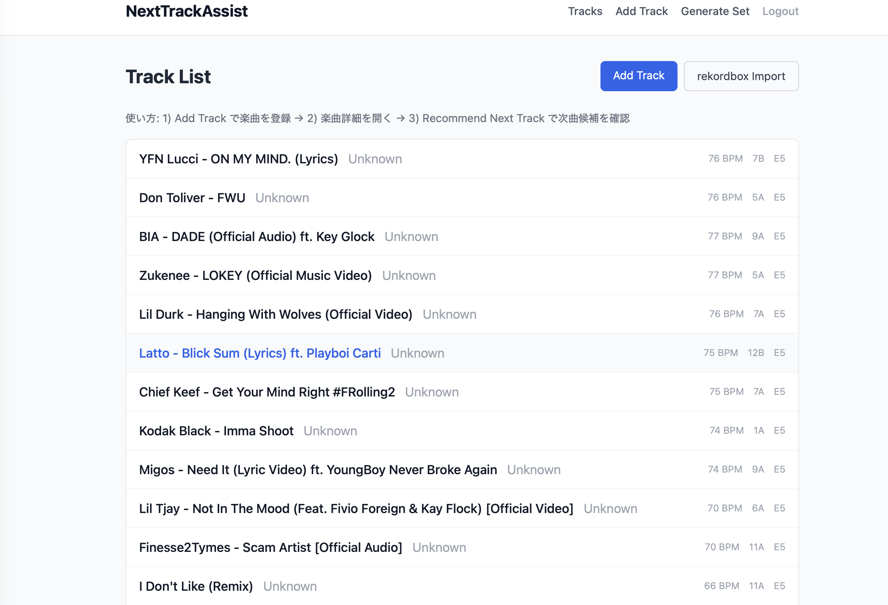
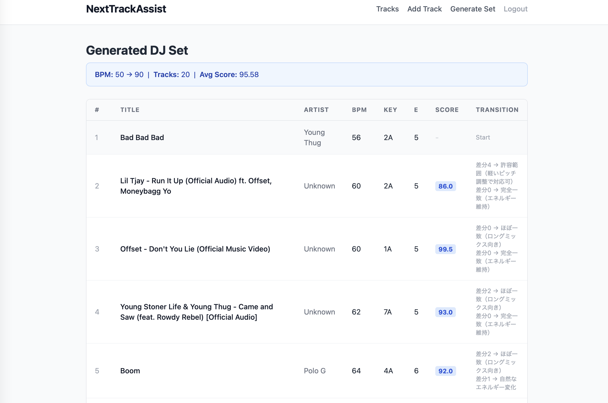

# NextTrackAssist


**NextTrackAssist** は、DJの次曲選択を支援するスコアリング型Webアプリケーションです。

DJの選曲は経験や感覚に依存する部分が大きく、BPM・Key・Energy の流れが崩れるとセット全体の一体感が失われます。
NextTrackAssist はその判断を数値化し、次曲候補を定量的にスコアリングして提示します。

> **Motivation:** DJとして活動する中で「次の曲どうする？」という判断をロジックで補えないかと思ったのが開発のきっかけです。
> BPM / Key / Energy の3要素をスコアリングすることで、感覚だけに頼らない選曲をサポートします。

### スクリーンショット

| トラック一覧 | DJセット自動生成 |
|:---:|:---:|
|  |  |

---

## アーキテクチャ

```
┌──────────┐      HTTPS       ┌───────────────┐      proxy_pass     ┌──────────────┐
│  Browser  │ ──────────────▶ │  Nginx (:443) │ ──────────────────▶ │ Gunicorn     │
│           │                 │  SSL終端       │                     │ Flask App    │
└──────────┘                  │  Let's Encrypt │                     │ (:8000)      │
                              └───────────────┘                     └──────┬───────┘
                                                                          │
                                                        ┌─────────────────┼──────────────────┐
                                                        │                 │                  │
                                                   ┌────▼────┐    ┌──────▼──────┐    ┌──────▼──────┐
                                                   │  auth   │    │   tracks    │    │    api     │
                                                   │Blueprint│    │  Blueprint  │    │  Blueprint  │
                                                   └────┬────┘    └──────┬──────┘    └──────┬──────┘
                                                        │                │                  │
                                                        └────────┬───────┘                  │
                                                                 │                          │
                                                          ┌──────▼──────┐            ┌──────▼──────┐
                                                          │  Services   │            │  REST API   │
                                                          │ score.py    │            │  JSON応答    │
                                                          │ rekordbox.py│            └─────────────┘
                                                          │ set_gen.py  │
                                                          └──────┬──────┘
                                                                 │
                                                          ┌──────▼──────┐
                                                          │ PostgreSQL  │
                                                          │ SQLAlchemy  │
                                                          └─────────────┘
```

---

## 目次

- [機能一覧](#機能一覧)
- [推薦ロジック](#推薦ロジック)
- [DJセット自動生成](#djセット自動生成)
- [REST API](#rest-api)
- [技術スタック](#技術スタック)
- [DB設計](#db設計)
- [ディレクトリ構成](#ディレクトリ構成)
- [セットアップ（Docker）](#セットアップdocker)
- [セットアップ（ローカル）](#セットアップローカル)
- [テスト実行](#テスト実行)
- [HTTPS / 本番構成](#https--本番構成)
- [今後の展望](#今後の展望)

---

## 機能一覧

| 機能 | 説明 |
|------|------|
| ユーザー登録 / ログイン | メールアドレス + パスワード認証（セッション管理） |
| トラック一覧 | ログインユーザーの登録曲を一覧表示 |
| トラック登録 | BPM・Key（Camelot形式）・Energy を含む曲情報を登録 |
| トラック編集 / 削除 | 自分のトラックのみ操作可能（所有権チェック済み） |
| 次曲推薦 | 選択した曲を基準に、相性スコア順で上位10曲を提示 |
| 推薦理由の表示 | BPM / Key / Energy それぞれの評価理由を日本語で表示 |
| rekordbox CSVインポート | rekordbox エクスポートファイルからトラックを一括登録。Musical Key → Camelot形式への自動変換、UTF-8/UTF-16対応 |
| DJセット自動生成 | BPMカーブ（開始→目標）を指定して、最適なDJセットを自動構築 |
| REST API | 全機能をJSONで提供（フロントエンド・外部連携用） |

---

## 推薦ロジック

推薦スコアは3つの指標を **加重平均** で算出します。

```
総合スコア = BPMスコア × 0.70 + Energyスコア × 0.20 + Keyスコア × 0.10
```

**BPM を最優先（weight: 0.70）** としているのは、DJミックスにおいてテンポのズレが最も致命的だからです。

### BPMスコア（weight: 0.70）

| BPM差分 | スコア | 評価 |
|---------|--------|------|
| 0〜2    | 100    | ほぼ一致 → ロングミックス向き |
| 3       | 90     | 許容範囲 → 軽いピッチ調整で対応可 |
| 4       | 80     | 〃 |
| 5       | 70     | 〃 |
| 6       | 60     | やや離れている → ブレイク・カットイン推奨 |
| 7       | 40     | 〃 |
| 8       | 20     | 〃 |
| 9       | 5      | 大きくズレている → テンポチェンジ向き |
| 10+     | 0      | 〃 |

### Keyスコア（weight: 0.10） ― Camelot Wheel 準拠

| 関係 | スコア | 例 |
|------|--------|----|
| 完全一致 | 100 | 8A → 8A |
| 隣接・同Letter | 95 | 8A → 9A（循環: 12A → 1A） |
| 同Number・相対調 | 90 | 8A → 8B |
| 隣接・異Letter | 80 | 8A → 9B |
| 非関連 | 30 | それ以外 |

### Energyスコア（weight: 0.20）

| Energy差分 | スコア |
|------------|--------|
| 0 | 100 |
| 1 | 95 |
| 2 | 85 |
| 3 | 70 |
| 4 | 50 |
| 5 | 30 |
| 6+ | 10 |

---

## DJセット自動生成

BPMの開始値と目標値を指定すると、ライブラリから最適な曲順を自動生成します。

### アルゴリズム

1. **開始曲の選定**: `start_bpm` に最も近いBPMのトラックを自動選択
2. **貪欲法（Greedy Algorithm）** による逐次選択:
   - 残りステップ数から「次に期待されるBPM」を線形補間で算出
   - 各候補曲に対して `calc_total_score`（BPM 70% + Energy 20% + Key 10%）を計算
   - BPMカーブからの逸脱に対するペナルティ（最大30点）を減算
   - 調整済みスコアが最高の曲を選択
3. **結果**: BPMカーブ・Energyカーブ・平均スコアを含むセット情報を返却

```
期待BPM = 現在BPM + (目標BPM - 現在BPM) / 残りステップ数
ペナルティ = min(|候補BPM - 期待BPM| × 3, 30)
選択スコア = total_score - ペナルティ
```

---

## REST API

全エンドポイントで `@login_required`（セッション認証）が必要です。

### GET /api/tracks

ログインユーザーの全トラックを取得。

```bash
curl -b cookies.txt https://your-domain.com/api/tracks
```

```json
[
  {"id": 1, "title": "Track A", "artist": "Artist 1", "bpm": 128, "key": "8A", "energy": 6}
]
```

### POST /api/import

rekordbox CSV をアップロードしてトラックを一括登録。

```bash
curl -b cookies.txt -X POST \
  -F "csv_file=@rekordbox_export.csv" \
  -F "default_energy=5" \
  https://your-domain.com/api/import
```

```json
{"imported": 5, "skipped": 2, "skip_reasons": ["..."]}
```

### GET /api/recommend/\<track_id\>

指定トラックに対する推薦結果を取得。

```bash
curl -b cookies.txt https://your-domain.com/api/recommend/1
```

```json
{
  "base_track": {"id": 1, "title": "Track A", "bpm": 128, "key": "8A", "energy": 6},
  "recommendations": [
    {"id": 2, "title": "Track B", "total_score": 92.5, "bpm_score": 95, "...": "..."}
  ]
}
```

### POST /api/generate-set

DJセットを自動生成。

```bash
curl -b cookies.txt -X POST \
  -H "Content-Type: application/json" \
  -d '{"start_bpm": 126, "target_bpm": 134, "num_tracks": 10}' \
  https://your-domain.com/api/generate-set
```

```json
{
  "tracks": ["..."],
  "bpm_curve": [126, 128, 130, 132, 134],
  "energy_curve": [6, 7, 7, 8, 8],
  "avg_score": 87.3,
  "total_tracks": 10
}
```

---

## 技術スタック

| カテゴリ | 技術 |
|----------|------|
| 言語 | Python 3.11 |
| Webフレームワーク | Flask 3.x（App Factory + Blueprint） |
| ORM | SQLAlchemy 2.0 |
| DB | PostgreSQL 15 |
| 認証 | Flask セッション + Werkzeug パスワードハッシュ |
| セキュリティ | Flask-WTF（CSRF保護）、HTTPS（Let's Encrypt）、セキュリティヘッダー |
| コンテナ | Docker / Docker Compose |
| Webサーバー | Gunicorn + Nginx（SSL終端リバースプロキシ） |
| テスト | pytest（SQLite インメモリDB） |
| CI/CD | GitHub Actions（push 時に pytest 自動実行） |
| クラウド | Railway（Docker デプロイ） |

---

## DB設計

### ER図（概念）

```
users
├── id          INTEGER  PK
├── email       VARCHAR(255)  UNIQUE / INDEX
├── password_hash VARCHAR(255)
└── created_at  TIMESTAMPTZ

tracks
├── id          INTEGER  PK
├── user_id     INTEGER  FK → users.id  (CASCADE DELETE) / INDEX
├── title       VARCHAR(255)
├── artist      VARCHAR(255)
├── bpm         INTEGER  CHECK(40 <= bpm <= 250)
├── key         VARCHAR(3)   Camelot形式 例: 8A, 11B
└── energy      INTEGER  CHECK(1 <= energy <= 10)
```

### 制約の設計意図

- `bpm BETWEEN 40 AND 250`：実際の楽曲のBPM帯をカバーする現実的な範囲
- `energy BETWEEN 1 AND 10`：DJツールの一般的なエネルギースケールに合わせた設計
- `key` はCamelot記法（1A〜12B）に統一：Mixkey / Rekordbox との互換性を意識
- `CASCADE DELETE`：ユーザー削除時にトラックも連動削除し、孤立レコードを防ぐ

---

## ディレクトリ構成

```
NextTrackAssist/
├── app/
│   ├── __init__.py          # App Factory・Blueprint登録・エラーハンドラー
│   ├── config.py            # 設定（SECRET_KEY, DATABASE_URL）
│   ├── extensions.py        # SQLAlchemy エンジン・セッション定義
│   ├── models/
│   │   ├── user.py          # User モデル
│   │   └── track.py         # Track モデル（DB制約含む）
│   ├── routes/
│   │   ├── auth.py          # 認証ルート（register / login / logout）
│   │   ├── tracks.py        # トラック CRUD + 推薦 + セット生成ルート
│   │   └── api.py           # REST API（JSON応答）
│   ├── services/
│   │   ├── score.py         # 推薦スコアリングロジック（ドメイン層）
│   │   ├── rekordbox.py     # rekordbox CSV パーサー・Camelotキー変換
│   │   └── set_generator.py # DJセット自動生成（貪欲法）
│   └── utils/
│       └── auth.py          # @login_required デコレータ
├── templates/
│   ├── base.html
│   ├── auth/
│   │   ├── login.html
│   │   └── register.html
│   ├── tracks/
│   │   ├── index.html
│   │   ├── new.html
│   │   ├── detail.html
│   │   ├── edit.html
│   │   ├── recommend.html
│   │   ├── import.html       # rekordbox CSVインポートフォーム
│   │   ├── generate_set.html # セット生成フォーム
│   │   └── set_result.html   # セット生成結果表示
│   └── errors/
│       ├── 404.html
│       └── 500.html
├── migrations/
│   └── 001_initial.py       # 初回テーブル作成マイグレーション
├── scripts/
│   ├── migrate.py           # Docker起動時マイグレーション実行スクリプト
│   └── init_db.py           # DB接続確認スクリプト
├── tests/
│   ├── conftest.py           # pytest フィクスチャ（SQLite インメモリ）
│   ├── test_app.py           # アプリ全体・データ分離テスト
│   ├── test_auth.py          # 認証テスト
│   ├── test_tracks.py        # トラック CRUD・推薦テスト
│   ├── test_score.py         # スコアリングロジック単体テスト
│   ├── test_rekordbox.py     # rekordbox CSVパーサー単体テスト
│   ├── test_set_generator.py # セット生成ロジック単体テスト
│   └── test_api.py           # REST APIエンドポイントテスト
├── nginx/
│   └── nginx.conf           # Nginx SSL終端リバースプロキシ設定
├── .github/
│   └── workflows/
│       └── ci.yml           # GitHub Actions（push 時に pytest 自動実行）
├── Dockerfile
├── docker-compose.yml
├── requirements.txt
└── pytest.ini
```

### 設計上の意図

- **App Factory パターン**（`create_app()`）：テスト時に異なる設定でアプリを生成可能
- **Blueprint 分離**（`auth_bp` / `tracks_bp` / `api_bp`）：責務ごとにルートを整理
- **Service 層**（`services/`）：推薦ロジック・セット生成をルートから分離し、単体テスト可能に
- **`@login_required` デコレータ**：`g.current_user` にユーザーを格納し、各ルートで再取得不要
- **`_find_user_track()`**：`track_id AND user_id` の二重フィルタで所有権を担保（IDOR対策）

---

## セットアップ（Docker）

```bash
git clone https://github.com/gizmo-lit-py/NextTrackAssist.git
cd NextTrackAssist

# 起動（DB作成 + マイグレーション + サーバー起動まで自動）
docker-compose up --build
```

ブラウザで `http://localhost` にアクセスしてください。

### 環境変数

| 変数 | 説明 | デフォルト（dev） |
|------|------|------------------|
| `SECRET_KEY` | Flask セッション暗号化キー | `dev-secret-key`（**本番では必ず変更**） |
| `DATABASE_URL` | PostgreSQL 接続URL | `docker-compose.yml` 内で設定済み |
| `WTF_CSRF_ENABLED` | CSRF保護の有効/無効 | `True`（テスト時のみ `False`） |

---

## セットアップ（ローカル）

```bash
# 1. 仮想環境の作成・有効化
python -m venv .venv
source .venv/bin/activate  # Windows: .venv\Scripts\activate

# 2. 依存関係インストール
pip install -r requirements.txt

# 3. 環境変数の設定（.envファイルを作成）
cp .env.example .env
# .env の DATABASE_URL と SECRET_KEY を編集

# 4. DB作成（PostgreSQL が起動済みであること）
python scripts/migrate.py

# 5. 開発サーバー起動
flask --app "app:create_app()" run
```

---

## テスト実行

テストは SQLite インメモリDBを使用するため、PostgreSQL の起動は不要です。

```bash
pytest tests/ -v
```

```
tests/test_app.py             ...   # データ分離・スコープテスト
tests/test_auth.py            ......  # 認証テスト
tests/test_score.py           ...............  # スコアリングロジック単体テスト
tests/test_tracks.py          ..............  # CRUD・推薦・バリデーションテスト
tests/test_rekordbox.py       .................  # rekordbox CSVパーサー単体テスト
tests/test_set_generator.py   ........  # セット生成ロジック単体テスト
tests/test_api.py             ..........  # REST APIエンドポイントテスト
```

---

## HTTPS / 本番構成

本番環境では Nginx でSSLを終端し、Gunicorn へリバースプロキシします。

```
Client ──HTTPS(:443)──▶ Nginx ──HTTP──▶ Gunicorn(:8000) ──▶ Flask App
```

### セキュリティヘッダー

| ヘッダー | 値 | 目的 |
|----------|-----|------|
| `Strict-Transport-Security` | `max-age=31536000; includeSubDomains` | HSTS強制 |
| `X-Frame-Options` | `DENY` | クリックジャッキング防止 |
| `X-Content-Type-Options` | `nosniff` | MIMEタイプスニッフィング防止 |
| `X-XSS-Protection` | `1; mode=block` | XSSフィルター有効化 |

### SSL証明書（Let's Encrypt）

```bash
# Certbot でSSL証明書を取得
certbot certonly --webroot -w /var/www/certbot -d your-domain.com
```

---

## 技術的な意思決定

このプロジェクトでは、いくつかの設計判断を意図的に行っています。

### なぜ BPM の重みを 70% にしたか

DJミックスにおいて、テンポのズレは最も致命的です。Key が多少合わなくても EQ で誤魔化せますが、BPM が 5 以上ずれるとビートマッチが破綻し、フロアの空気が途切れます。実際にDJをしている経験から、BPM の一致度を最優先とし 70% の重みを設定しました。Energy（20%）と Key（10%）は「合えばより良い」という位置づけです。

### なぜ貪欲法（Greedy）を選んだか

DJセットの自動生成では、動的計画法（DP）を使えば理論上は最適解が得られます。しかし、トラック数が 100〜500 曲規模になると計算量が爆発し、レスポンスが遅くなります。DJセット生成は「厳密な最適」よりも「十分に良い順序を素早く返す」方が実用的なため、O(n²) の貪欲法を採用しました。BPMカーブからの逸脱にペナルティを課すことで、貪欲法でも自然なBPM推移を実現しています。

### なぜ JWT ではなくセッション認証にしたか

このアプリはサーバーサイドレンダリング（Jinja2テンプレート）で構成されており、フロントエンドの SPA はありません。セッション認証は Flask に組み込みで対応でき、CSRF保護（Flask-WTF）との相性も良く、実装がシンプルです。モバイルアプリや外部サービスとの連携が必要になった段階で JWT への移行を検討する方針です。

---

## 今後の展望

- [ ] ページネーション（トラック一覧・推薦結果）
- [ ] Spotify API 連携（曲名検索 → BPM/Key 自動取得）
- [ ] BPM / Energy カーブのグラフ可視化（Chart.js）
- [x] UI改善（Tailwind CSS 導入、全13テンプレート改修）
- [x] rekordbox 日本語版エクスポート対応（`トラックタイトル` 列名追加・Artist空補完）
- [x] DJセット自動生成（貪欲法 + BPMカーブ制御）
- [x] REST API（4エンドポイント）
- [x] HTTPS対応（Nginx SSL終端 + セキュリティヘッダー）
- [x] GitHub Actions による CI/CD
- [x] rekordbox CSV インポート
- [x] Railway への本番デプロイ対応

---

## 開発メモ

本プロジェクトの一部はAIアシスタント（Claude）を活用してリファクタリングを行いました。
ロジックの設計・テスト設計・コードレビューの観点出しに使用しています。
